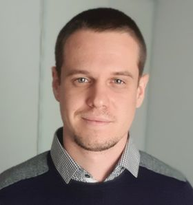

# Welcome, I am gaëtan Frusque !

 

My research interests are centred around multivariate signal processing and machine learning tools for time series analysis. I am also very interested by sparse optimisation. 
 
I recently obtained a PhD at LIP, ENS Lyon entitled “inferences and decompositions of dynamical graphs with application to neuroscience”. The aim of my work was to create innovative data visualization tools to understand how epilepsy propagates in the brain. I had to work with datasets in the form of multivariate time series and graphs evolving through time. 
 
I am currently looking for a new position. I want to invest my competences in projects related to signal processing and machine learning, work in a team and acquire new knowledge.
 
My CV is available [here](./Support/cvcv.pdf)

 